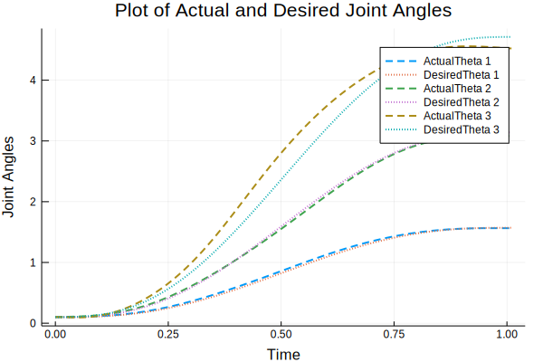

# Examples

Here are some examples for Forward and Inverse Dynamics Trajectories, and Control Simulation.

## Contents

```@contents
Pages = ["examples.md"]
```

## Inverse Dynamics Trajectory

```julia
using ModernRoboticsBook

import LinearAlgebra
const linalg = LinearAlgebra;
```

Create a trajectory to follow using functions from Chapter 9:

```julia
thetastart = [0, 0, 0]

thetaend = [π / 2, π / 2, π / 2]

Tf = 3

N = 1000

method = 5

traj = JointTrajectory(thetastart, thetaend, Tf, N, method)

thetamat = copy(traj)
dthetamat = zeros(1000, 3)
ddthetamat = zeros(1000, 3)

dt = Tf / (N - 1.0)

for i = 1:size(traj, 1) - 1
    dthetamat[i + 1, :] = (thetamat[i + 1, :] - thetamat[i, :]) / dt
    ddthetamat[i + 1, :] = (dthetamat[i + 1, :] - dthetamat[i, :]) / dt
end
```

Initialize robot description (example with 3 links):

```julia
g = [0, 0, -9.8]

Ftipmat = ones(N, 6)

M01 = [ 1 0 0        0 ;
        0 1 0        0 ;
        0 0 1 0.089159 ;
        0 0 0        1 ]

M12 = [ 0 0 1    0.28 ;
        0 1 0 0.13585 ;
       -1 0 0       0 ;
        0 0 0       1 ]

M23 = [ 1 0 0       0 ;
        0 1 0 -0.1197 ;
        0 0 1   0.395 ;
        0 0 0       1 ]

M34 = [ 1 0 0       0 ;
        0 1 0       0 ;
        0 0 1 0.14225 ;
        0 0 0       1 ]

Mlist = [M01, M12, M23, M34]

G1 = linalg.Diagonal([0.010267, 0.010267, 0.00666, 3.7, 3.7, 3.7])
G2 = linalg.Diagonal([0.22689, 0.22689, 0.0151074, 8.393, 8.393, 8.393])
G3 = linalg.Diagonal([0.0494433, 0.0494433, 0.004095, 2.275, 2.275, 2.275])

Glist = [G1, G2, G3]

Slist = [ 1 0 1      0 1     0 ;
          0 1 0 -0.089 0     0 ;
          0 1 0 -0.089 0 0.425 ]'

taumat = InverseDynamicsTrajectory(thetamat, dthetamat, ddthetamat, g, Ftipmat, Mlist, Glist, Slist)
```

Plot the joint forces/torques:

```julia
using Plots
gr()

timestamp = range(1, Tf, length=N)

plot(timestamp, taumat[:, 1], linewidth=2, label="Tau 1")
plot!(timestamp, taumat[:, 2], linewidth=2, label="Tau 2")
plot!(timestamp, taumat[:, 3], linewidth=2, label="Tau 3")

xlabel!("Time")
ylabel!("Torque")
title!("Plot of Torque Trajectories")
```


## Forward Dynamics Trajectory

```julia
dt = 0.1

intRes = 8

thetalist = [0.1, 0.1, 0.1]

dthetalist = [0.1, 0.2, 0.3]

taumat = [[3.63, -6.58, -5.57], [3.74, -5.55,  -5.5],
          [4.31, -0.68, -5.19], [5.18,  5.63, -4.31],
          [5.85,  8.17, -2.59], [5.78,  2.79,  -1.7],
          [4.99,  -5.3, -1.19], [4.08, -9.41,  0.07],
          [3.56, -10.1,  0.97], [3.49, -9.41,  1.23]]

taumat = cat(taumat..., dims=2)'

thetamat, dthetamat = ForwardDynamicsTrajectory(thetalist, dthetalist, taumat, g,
                                                Ftipmat, Mlist, Glist, Slist, dt, intRes)
```

Plot the joint angle/velocities:

```julia
theta1 = thetamat[:, 1]
theta2 = thetamat[:, 2]
theta3 = thetamat[:, 3]

dtheta1 = dthetamat[:, 1]
dtheta2 = dthetamat[:, 2]
dtheta3 = dthetamat[:, 3]

N = size(taumat, 1)
Tf = size(taumat, 1) * dt

timestamp = range(0, Tf, length=N)

plot(timestamp, theta1, linewidth=2, label="Theta1")
plot!(timestamp, theta2, linewidth=2, label="Theta2")
plot!(timestamp, theta3, linewidth=2, label="Theta3")

plot!(timestamp, dtheta1, linewidth=2, label="DTheta1")
plot!(timestamp, dtheta2, linewidth=2, label="DTheta2")
plot!(timestamp, dtheta3, linewidth=2, label="DTheta3")

xlabel!("Time")
ylabel!("Joint Angles/Velocities")
title!("Plot of Joint Angles and Joint Velocities")
```


## Simulate Control

Create a trajectory to follow:

```julia
thetaend = [π / 2, π, 1.5 * π]

Tf = 1
dt = 0.01
N = round(Int, Tf / dt)
method = 5

traj = JointTrajectory(thetalist, thetaend, Tf, N, method)

thetamatd = copy(traj)
dthetamatd = zeros(N, 3)
ddthetamatd = zeros(N, 3)

dt = Tf / (N - 1)

for i = 1:size(traj, 1)-1
    dthetamatd[i + 1, :] = (thetamatd[i + 1, :] - thetamatd[i, :]) / dt
    ddthetamatd[i + 1, :] = (dthetamatd[i + 1, :] - dthetamatd[i, :]) / dt
end
```

Create a (possibly) wrong robot description:

```julia
gtilde = [0.8, 0.2, -8.8]

Mhat01 = [1 0 0   0 ;
          0 1 0   0 ;
          0 0 1 0.1 ;
          0 0 0   1 ]

Mhat12 = [ 0 0 1 0.3 ;
           0 1 0 0.2 ;
          -1 0 0   0 ;
           0 0 0   1 ]

Mhat23 = [1 0 0    0 ;
          0 1 0 -0.2 ;
          0 0 1  0.4 ;
          0 0 0    1 ]

Mhat34 = [1 0 0   0 ;
          0 1 0   0 ;
          0 0 1 0.2 ;
          0 0 0   1 ]

Mtildelist = [Mhat01, Mhat12, Mhat23, Mhat34]

Ghat1 = linalg.Diagonal([0.1, 0.1, 0.1, 4, 4, 4])
Ghat2 = linalg.Diagonal([0.3, 0.3, 0.1, 9, 9, 9])
Ghat3 = linalg.Diagonal([0.1, 0.1, 0.1, 3, 3, 3])

Gtildelist = [Ghat1, Ghat2, Ghat3]

Ftipmat = ones(size(traj, 1), 6)

Kp = 20
Ki = 10
Kd = 18

intRes = 8

taumat, thetamat = SimulateControl(thetalist, dthetalist, g, Ftipmat, Mlist, Glist,
                                   Slist, thetamatd, dthetamatd, ddthetamatd, gtilde,
                                   Mtildelist, Gtildelist, Kp, Ki, Kd, dt, intRes)
```

Finally, plot the results:

```julia
N, links = size(thetamat)

Tf = N * dt

timestamp = range(0, Tf, length=N)

plot()

for i = 1:links
    plot!(timestamp, thetamat[:, i], lw=2, linestyle=:dash, label="ActualTheta $i")
    plot!(timestamp, thetamatd[:, i], lw=2, linestyle=:dot, label="DesiredTheta $i")
end

xlabel!("Time")
ylabel!("Joint Angles")
title!("Plot of Actual and Desired Joint Angles")
```


